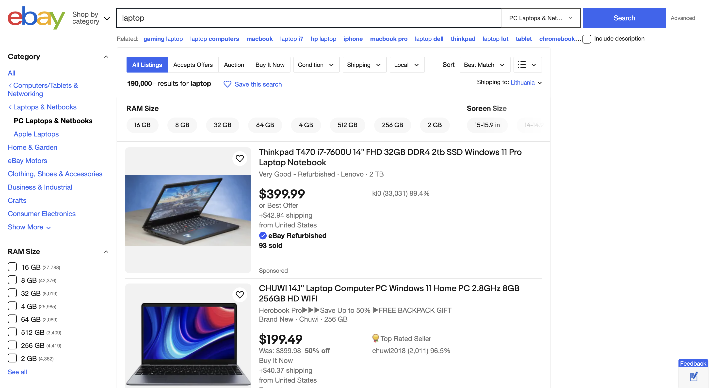
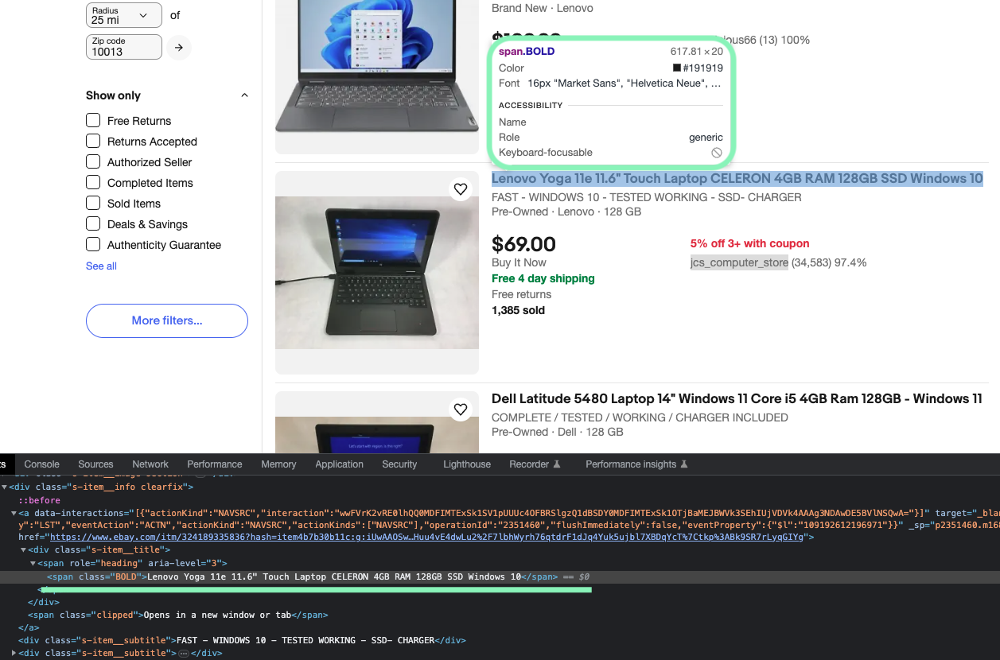
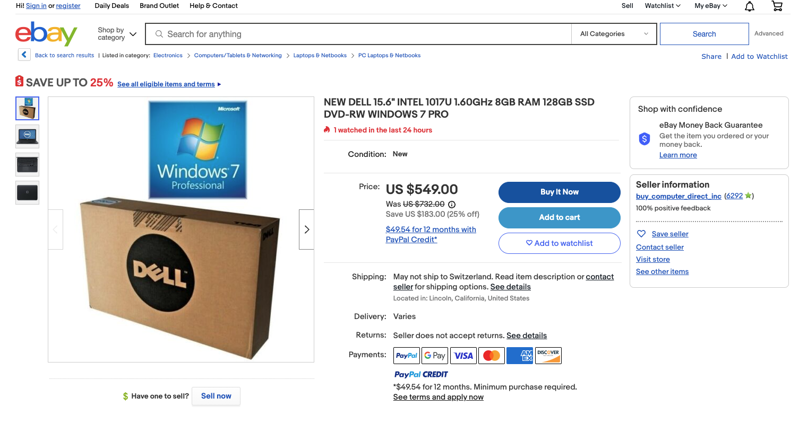
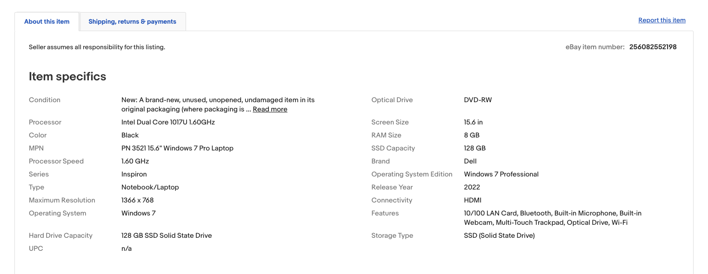

# How to Write Parsing Instructions with Custom Parser?
- [The structure of parsing instructions](#the-structure-of-parsing-instructions)
- [How to write parsing instructions](#how-to-write-parsing-instructions)
  * [Configuring the payload](#configuring-the-payload)
  * [Parsing a single field](#parsing-a-single-field)
  * [Parsing multiple fields with separated results](#parsing-multiple-fields-with-separated-results)
  * [Parsing multiple fields with categorized results](#parsing-multiple-fields-with-categorized-results)
- [Parsing example of a real target](#parsing-example-of-a-real-target)
  * [Product listings](#product-listings)
  * [Product page](#product-page)

Custom Parser is a free feature of Oxylabs [<u>Scraper APIs</u>](https://oxylabs.io/products/scraper-api), which allows you to write your own parsing instructions for a chosen target when needed. While [<u>Adaptive Parser</u>](https://oxylabs.io/features/adaptive-parser), a feature of Scraper APIs, enables automated parsing of almost any e-commerce product page, the Custom Parser feature expands your options and flexibility throughout the entire process.

With it, you can:

- Extract all text from an HTML document;

- Parse data using XPath expressions;

- Manipulate strings with pre-defined functions and regex expressions;

- Perform common string actions like conversion, indexing, and retrieving the length;

- Do mathematical calculations, such as calculating the average, finding the maximum and minimum values, and multiplying values.

This guide will teach you the fundamentals of writing custom parsing
instructions in Python and will showcase Custom Parser in action.

## The structure of parsing instructions

To start off, you should already have a basic grasp of Oxylabs Scraper
APIs. If you’re new to our web scraping solutions, you can familiarize
yourself by reading our [<u>documentation</u>](https://developers.oxylabs.io/scraper-apis/getting-started).
Note that you can only use one parser simultaneously – either a
Dedicated Parser, Adaptive Parser, or Custom Parser.

In essence, the parsing instructions have to be specified in the payload
of the request, which is composed in a JSON format. Parsing instructions
consist of HTML node selection and value transformation functions.

You’re going to use XPath expressions to select HTML nodes and extract
data from them. We highly recommend reading our [<u>blog
post</u>](https://oxylabs.io/blog/xpath-vs-css), where we introduce the
basics of using XPath.

The two XPath functions of Custom Parser are `xpath`, which returns all
matches, and `xpath_one`, which returns the first match. You can learn
more about other functions in our [<u>documentation</u>](https://developers.oxylabs.io/).

The structure of parsing instructions can be summed up into four main
steps:

1.  Name of a field that will store the results;

2.  `_fns` array that holds all the specific parsing instructions for that field;

3.  `_fn` function that defines the action;

4.  `_args` variables that modify the behavior of the `_fn` associated with it.

The following code sample illustrates these steps:

```python
{
    "parsing_instructions": {
        "Result field name": {      # 1.
            "_fns": [               # 2.
                {
                    "_fn": "What action to perform?",        # 3.
                    "_args": ["How to perform the action?"]  # 4.
                }
            ]
        }
    }
}
```

## How to write parsing instructions

We’ll use a dummy bookstore website,
[<u>books.toscrape.com</u>](https://books.toscrape.com/catalogue/page-1.html),
to showcase several ways you can extract the desired information.

### Configuring the payload

First, define the necessary payload parameters for your specific needs,
then add the `"parse": True` parameter to enable parsing. Next, add the
`"parsing_instructions"` parameter to define the parsing instructions
within the curly brackets. So far, your payload should look similar to
this:
```python
payload = {
    "source": "universal",
    "url": "https://books.toscrape.com/catalogue/page-1.html",
    "parse": True,
    "parsing_instructions": {}
}
```
### Parsing a single field

Let’s start by gathering all the book titles from our [<u>target
page</u>](https://books.toscrape.com/catalogue/page-1.html). Create a
new JSON object and assign a new field, which will hold a list of all
the book titles. This field name will be displayed in the parsed result.
Let’s call it `"titles"`:

> **Note**
> 
> When creating custom parameter names, you can’t use the
underscore symbol `_` at the very beginning.

```python
{
    "parsing_instructions": {
        "titles": {}
    }
}
```
Next, let’s add the `_fns` array to define a data processing pipeline.
This property will hold all the instructions required to parse the book
titles from our target:
```python
{
    "parsing_instructions": {
        "titles": {
            "_fns": []
        }
    }
}
```
Then, in the square brackets of the `_fns` field, add the `_fn` and
`_args` properties:
```python
{
    "parsing_instructions": {
        "titles": {
            "_fns": [
                {
                    "_fn": "",
                    "_args": [""]
                }
            ]
        }
    }
}
```
In order to parse all the book titles, set `"_fn"` value to `"xpath"` and
provide one or more XPath expressions in the `"_args"` array. Please note
that the XPath expressions will be executed in the order they’re found
in the array. For instance, if the first XPath expression is valid (i.e.
the node exists), subsequent XPath expressions won’t be executed.

In this case, all the book titles are in the `<a>` tags, which are
inside the `<h3>` tag, so the XPath expression can be written as
`"//h3//a/text()"`. The `text()` in the XPath expression instructs the
parser to select only the textual values:
```python
import requests
from pprint import pprint

payload = {
    "source": "universal",
    "url": "https://books.toscrape.com/catalogue/page-1.html",
    "parse": True,
    "parsing_instructions": {
        "titles": {
            "_fns": [
                {
                    "_fn": "xpath",
                    "_args": ["//h3//a/text()"]
                }
            ]
        }
    }
}

response = requests.request(
    "POST",
    "https://realtime.oxylabs.io/v1/queries",
    auth=("USERNAME", "PASSWORD"),
    json=payload
)

pprint(response.json())
```
This code produces the following list of book titles:
```bash
{
  "titles": [
    "A Light in the ...",
    "Tipping the Velvet",
    "Soumission",
    "Sharp Objects",
    "Sapiens: A Brief History ...",
    "The Requiem Red",
    "The Dirty Little Secrets ...",
    "The Coming Woman: A ...",
    "The Boys in the ...",
    "The Black Maria",
    "Starving Hearts (Triangular Trade ...",
    "Shakespeare's Sonnets",
    "Set Me Free",
    "Scott Pilgrim's Precious Little ...",
    "Rip it Up and ...",
    "Our Band Could Be ...",
    "Olio",
    "Mesaerion: The Best Science ...",
    "Libertarianism for Beginners",
    "It's Only the Himalayas"
  ]
}
```
### Parsing multiple fields with separated results

Let’s include the book prices, which are in the `<p>` tag with an
attribute `class="price_color"`. You can separate the results by creating
another field that will hold the prices. The process is the same as
explained previously – you have to create another field called `"prices"`,
just like you did with the `"titles"`. The parsing instructions should be
as follows:
```python
{
    "parsing_instructions": {
        "titles": {
            "_fns": [
                {
                    "_fn": "xpath",
                    "_args": ["//h3//a/text()"]
                }
            ]
        },
        "prices": {
            "_fns": [
                {
                    "_fn": "xpath",
                    "_args": ["//p[@class='price_color']/text()"]
                }
            ]
        }
    }
}
```
The output will give you results separated by fields:

```bash
{
  "prices": [
    "£51.77",
    "£53.74",
      
      ...
      
    "£51.33",
    "£45.17"
  ],
  "titles": [
    "A Light in the ...",
    "Tipping the Velvet",
      
      ...
      
    "Libertarianism for Beginners",
    "It's Only the Himalayas"
  ]
}
```

The results can also be categorized by product, which we’ll overview
next.

### Parsing multiple fields with categorized results

Say you want to get the **titles**, **prices**, **availability**, and
the **URL** of all the books on page 1. Following the logic of the
previous parsing instructions, the results would be separated into
different fields, which may not be a preferred way to parse product
listings.

Custom Parser allows you to categorize the results by product. To do
that, you can first define the parsing scope of the HTML document and
iterate over it with the `"_items"` function. This function tells our
system that every field inside it, such as `"title"`, is a part of one
item and should be grouped together.

By defining the parsing scope, you’re telling the system to look only at
a specific part of the HTML document. All books are listed within the
`<li>` tags, which are under the `<ol>` tag. Thus, you can use the XPath
expression `//ol//li` to define the parsing scope for book listings.

When defining the parsing scope, use the `xpath` function for the` _fn`
property to find everything that matches the XPath expression. At this
moment, the code should look like this:
```python
{
    "parsing_instructions": {
        "products": {
            "_fns": [
                {
                    "_fn": "xpath",
                    "_args": ["//ol//li"]
                }
            ]
        }
    }
}
```
Then, when using the `"_items"` property, use the `xpath_one` function to
find only the first match since the `"_items"` property will iterate over
the defined parsing scope, which finds all the matches. Let’s add the
**title**, **price**, **availability**, and **URL** fields to our code
inside the `"_items"` property:
```python
{
    "parsing_instructions": {
        "products": {
            "_fns": [
                {
                    "_fn": "xpath",
                    "_args": [
                        "//ol//li"
                    ]
                }
            ],
            "_items": {
                "title": {
                    "_fns": [
                        {
                            "_fn": "xpath_one",
                            "_args": [
                                ".//h3//a/text()"
                            ]
                        }
                    ]
                },
                "price": {
                    "_fns": [
                        {
                            "_fn": "xpath_one",
                            "_args": [
                                ".//p[@class='price_color']/text()"
                            ]
                        }
                    ]
                },
                "availability": {
                    "_fns": [
                        {
                            "_fn": "xpath_one",
                            "_args": [
                                "normalize-space(.//p[contains(@class, 'availability')]/text()[last()])"
                            ]
                        }
                    ]
                },
                "url": {
                    "_fns": [
                        {
                            "_fn": "xpath_one",
                            "_args": [
                                ".//a/@href"
                            ]
                        }
                    ]
                }
            }
        }
    }
}
```
With these parsing instructions, the results are categorized by product:
```bash
{
  "products": [
    {
      "availability": "In stock",
      "price": "£51.77",
      "title": "A Light in the ...",
      "url": "a-light-in-the-attic_1000/index.html"
    },
    {
      "availability": "In stock",
      "price": "£53.74",
      "title": "Tipping the Velvet",
      "url": "tipping-the-velvet_999/index.html"
    },
      
      ...
      
    {
      "availability": "In stock",
      "price": "£51.33",
      "title": "Libertarianism for Beginners",
      "url": "libertarianism-for-beginners_982/index.html"
    },
    {
      "availability": "In stock",
      "price": "£45.17",
      "title": "It's Only the Himalayas",
      "url": "its-only-the-himalayas_981/index.html"
    }
  ]
}
```

## Parsing example of a real target

### Product listings

In this section, let’s use Custom Parser to parse [<u>this product
listing page</u>](https://www.ebay.com/sch/i.html?_from=R40&_trksid=p2334524.m570.l1313&_nkw=laptop&_sacat=0&LH_TitleDesc=0&_odkw=laptop&_osacat=0) on eBay:



The goal is to extract the **title**, **price**, **item condition**,
**URL**, and **seller information** from each product listing.

Here, you can again define the parsing scope. All of the products are
inside the `<li>` tag with the attribute `data-viewport`, which is under
the `<ul>` tag. With this information, you can form the XPath expression
as `//ul//li[@data-viewport]`:

```python
{
    "parsing_instructions": {
        "products": {
            "_fns": [
                {
                    "_fn": "xpath",
                    "_args": ["//ul//li[@data-viewport]"]
                }
            ]
        }
    }
}
```

Following the same logic as shown previously, you can form the parsing
instructions within the `"_items"` function. Notice the second XPath
expression for the `"title"` field:
```python
{
    "parsing_instructions": {
        "products": {
            "_fns": [
                {
                    "_fn": "xpath",
                    "_args": [
                        "//ul//li[@data-viewport]"
                    ]
                }
            ],
            "_items": {
                "title": {
                    "_fns": [
                        {
                            "_fn": "xpath_one",
                            "_args": [
                                ".//span[@role='heading']/text()",
                                ".//span[@class='BOLD']/text()"
                            ]
                        }
                    ]
                },
                "price": {
                    "_fns": [
                        {
                            "_fn": "xpath_one",
                            "_args": [
                                ".//span[@class='s-item__price']/text()"
                            ]
                        }
                    ]
                },
                "condition": {
                    "_fns": [
                        {
                            "_fn": "xpath_one",
                            "_args": [
                                ".//span[@class='SECONDARY_INFO']/text()"
                            ]
                        }
                    ]
                },
                "seller": {
                    "_fns": [
                        {
                            "_fn": "xpath_one",
                            "_args": [
                                ".//span[@class='s-item__seller-info-text']/text()"
                            ]
                        }
                    ]
                },
                "url": {
                    "_fns": [
                        {
                            "_fn": "xpath_one",
                            "_args": [
                                ".//a/@href"
                            ]
                        }
                    ]
                }
            }
        }
    }
}
```
The additional XPath expression is used to fall back to if the first
expression doesn’t return any value. This is the case with our target
page since there are some titles found within the `<span>` tag with an
attribute set to `class="BOLD"`:



Let’s fully build up the code sample to parse eBay products:

```python
import requests
import json
from pprint import pprint

# Structure payload
payload = {
    "source": "universal_ecommerce",
    "url": "https://www.ebay.com/sch/i.html?_from=R40&_trksid=p2334524.m570.l1313&_nkw=laptop&_sacat=0&LH_TitleDesc=0&_odkw=laptop&_osacat=0",
    "geo_location": "United States",
    "parse": True,
    "parsing_instructions": {
        "products": {
            "_fns": [
                {
                    "_fn": "xpath",
                    "_args": [
                        "//ul//li[@data-viewport]"
                    ]
                }
            ],
            "_items": {
                "title": {
                    "_fns": [
                        {
                            "_fn": "xpath_one",
                            "_args": [
                                ".//span[@role='heading']/text()",
                                ".//span[@class='BOLD']/text()"
                            ]
                        }
                    ]
                },
                "price": {
                    "_fns": [
                        {
                            "_fn": "xpath_one",
                            "_args": [
                                ".//span[@class='s-item__price']/text()"
                            ]
                        }
                    ]
                },
                "condition": {
                    "_fns": [
                        {
                            "_fn": "xpath_one",
                            "_args": [
                                ".//span[@class='SECONDARY_INFO']/text()"
                            ]
                        }
                    ]
                },
                "seller": {
                    "_fns": [
                        {
                            "_fn": "xpath_one",
                            "_args": [
                                ".//span[@class='s-item__seller-info-text']/text()"
                            ]
                        }
                    ]
                },
                "url": {
                    "_fns": [
                        {
                            "_fn": "xpath_one",
                            "_args": [
                                ".//a/@href"
                            ]
                        }
                    ]
                }
            }
        }
    }
}

# Get a response
response = requests.request(
    "POST",
    "https://realtime.oxylabs.io/v1/queries",
    auth=("USERNAME", "PASSWORD"),
    json=payload
)

# Write the JSON response to a JSON file
with open("ebay_product_listings.json", "w") as f:
    json.dump(response.json(), f)

# Instead of a response with job status and results URL, this will return
# the JSON response with the result
pprint(response.json())
```
It produces the output with the categorized information by product:

```bash
{
  "products": [
    {
      "condition": "Open Box",
      "price": "$399.95",
      "seller": "gtgeveryday (11,074) 98.8%",
      "title": "HP Laptop Computer 15.6 HD Notebook 16GB 512GB SSD Win11 Intel WiFi Bluetooth",
      "url": "https://www.ebay.com/itm/374483095044?hash=item5730ee8e04:g:GTUAAOSwSbJj1D3b&amdata=enc%3AAQAIAAAAsPgaQKZhgBOAcXj6BHSIXZIQGiVP2blfkVh8s73u2tYQm3wSJQspCiKEvx6MkyORjJyiWzBwmdeoUJbfYilH%2FVBZx53G1LAA4hGrr8mVA7tfse8gF64Ses9dWjo5htwiFoeaiqA34DKAXFUHH32KU03simn1pu9lZiXqQspPyDG0Dt7DAYB6aus%2B8lYRKfRVurYSajf4KLANNUE4HAStHK24pzEYsUABr1uNp8P5Czf%2F%7Ctkp%3ABlBMUMq35OKHYg"
    },
    {
      "condition": "Open Box",
      "price": "$599.00",
      "seller": "computergalleryonline (17,836) 100%",
      "title": "Microsoft Surface Pro 6 12.3 1.90GHz CORE i7 [8650U] 1TB SSD 16GB W10PRO Webcam",
      "url": "https://www.ebay.com/itm/255069566836?hash=item3b6354b774:g:PMgAAOSwfTdg0j3a&amdata=enc%3AAQAIAAAAsNsgs7NCzOLwklJuBevZVZ6ohkW2lno%2F1Wh9r84C1AV1vlDrqncfYVQLFWtiFTwbXNMfy3YXkKqEqBEAS1SFMifni9n5V%2B8ZMC2zfAiNZX%2BWZH4VOXl2EZOKg69kdGaHAjL%2FEHcNZfkmIgLwvtmYoYbSeITVnXaGsiMS3qPwJHZcS0Qb2w%2BZgokPePR4thmBH%2Bc8cBwxA06a%2F5Hu1%2B7rOHz%2BXLmJ9iSLNJmBufaHk4Cp%7Ctkp%3ABlBMUMq35OKHYg"
    },
    {
      "condition": "Very Good - Refurbished",
      "price": "$130.58",
      "seller": "discountcomputerdepot (101,356) 98.6%",
      "title": "Lenovo ThinkPad Yoga 11e 5th Gen Touchscreen Laptop Windows 10 4GB Ram 256GB SSD",
      "url": "https://www.ebay.com/itm/254646198216?hash=item3b4a189fc8:g:RYEAAOSwmbVfA5~a&amdata=enc%3AAQAIAAAAsANRr%2F6XW4iwQrABynh1VKLP4xhMjrQSpGI2M%2B4Z3%2B1vWEAYS3Iadzz2OlIfrfs0UoipImK0fiYa5qxRmpaSQGZ24iCHofOVmQThBqyv4XDR3GhJoP718l5RKCB5cqSGLF69q7b2acskGS1Id064oQLtojZekMJzWOkLCb0tfIwV8jlgoJiE1NHoRowYhV%2FhmxRXAQpz9Ow7o9CHEqEsNO10bUSGbnc%2FYFDuPFRfRbp9%7Ctkp%3ABlBMUMq35OKHYg"
    },
    {
      "condition": "Brand New",
      "price": "$369.99",
      "seller": "antonline (319,396) 98.9%",
      "title": "Lenovo IdeaPad 3 14 Laptop FHD Intel Core i5-1135G7 8GB RAM 512GB SSD",
      "url": "https://www.ebay.com/itm/304852488846?hash=item46fa9fd28e:g:G5sAAOSwaMpkT3K1&amdata=enc%3AAQAIAAAAwI1TVVViXVxUCbkGokwpSEGjqhGuidyNYaY6VP22Kv8RqfeRYoUI8wKkSebTaTcFiY%2FjUz5t18Y0G8aU36cyKXbvhBq1%2Bv8mkBbNP3QtfBFFGnBu0d9OJ7x1f1RRac3c1iRiXb1jZd2TJMfNr7Ijen5y7t2Fv4bxwKL3%2BT7FAf6RPGbLpMXclyvJRPkxXuVab5g2U27DzDtuo6uJqp009pRyi%2F1QzehMXD6mAef9B6183jWkMEKtpN6F8ozshn3Yog%3D%3D%7Ctkp%3ABk9SR8y35OKHYg"
    }
  ]
}
```

### Product page

The parsing instructions to collect information from a specific product
page don’t differ too much, yet there’s a certain parsing logic you can
follow. For demonstrational purposes, let’s use [<u>this eBay product page</u>](https://www.ebay.com/itm/256082552198?hash=item3b9fb5a586:g:G20AAOSwm-9iUMjU&amdata=enc%3AAQAIAAAAsBVaJyw82KdZRRfIJpMYmmLIWty94MR%2FJXCYNOmilLafKM7iGdkVbac4c1CdxnzkJ9MhvAWumbBGriDQ%2BuRO5YtuapAckUKSwGnOjG3ITS4oP%2Bak%2FRPV%2B2mEba5veCK%2FpN2YYLn3rOyUjOoroU9Z1%2FBJ2xsih1S57d5U1yh%2B2o9m2L3lZFEe7flmjSKUbaVC%2BYPaSzZTYq%2BlNzVnk7sAniEurfuTzhiLHt58xBceAxUm%7Ctkp%3ABlBMUMSCmrWIYg)
to extract the **title**, **price**, and details from the **Item
specifics** section. The target page looks like this:





The **title** and **price** can be parsed with separate functions.
Notice the `"amount_from_string"` within the `"price"` field, which extracts
only the numeric value:

```python
{
    "source": "universal",
    "url": "https://www.ebay.com/itm/256082552198?hash=item3b9fb5a586:g:G20AAOSwm-9iUMjU&amdata=enc%3AAQAIAAAAsBVaJyw82KdZRRfIJpMYmmLIWty94MR%2FJXCYNOmilLafKM7iGdkVbac4c1CdxnzkJ9MhvAWumbBGriDQ%2BuRO5YtuapAckUKSwGnOjG3ITS4oP%2Bak%2FRPV%2B2mEba5veCK%2FpN2YYLn3rOyUjOoroU9Z1%2FBJ2xsih1S57d5U1yh%2B2o9m2L3lZFEe7flmjSKUbaVC%2BYPaSzZTYq%2BlNzVnk7sAniEurfuTzhiLHt58xBceAxUm%7Ctkp%3ABlBMUMSCmrWIYg",
    "geo_location": "United States",
    "parse": True,
    "parsing_instructions": {
        "title": {
            "_fns": [
                {
                    "_fn": "xpath_one",
                    "_args": ["//h1//span[@class='ux-textspans ux-textspans--BOLD']/text()"]
                }
            ]
        },
        "price": {
            "_fns": [
                {
                    "_fn": "xpath_one",
                    "_args": ["//div[@class='x-price-primary'][@data-testid='x-price-primary']//span[@class='ux-textspans']/text()"]
                },
                {
                    "_fn": "amount_from_string"
                }
            ]
        }
    }
}
```

Next, to parse the **Item specifics** section, define the parsing scope
and use the `"_items"` function to iterate through each key and value
pair:

```python
import requests
import json
from pprint import pprint

# Structure payload.
payload = {
    "source": "universal",
    "url": "https://www.ebay.com/itm/256082552198?hash=item3b9fb5a586:g:G20AAOSwm-9iUMjU&amdata=enc%3AAQAIAAAAsBVaJyw82KdZRRfIJpMYmmLIWty94MR%2FJXCYNOmilLafKM7iGdkVbac4c1CdxnzkJ9MhvAWumbBGriDQ%2BuRO5YtuapAckUKSwGnOjG3ITS4oP%2Bak%2FRPV%2B2mEba5veCK%2FpN2YYLn3rOyUjOoroU9Z1%2FBJ2xsih1S57d5U1yh%2B2o9m2L3lZFEe7flmjSKUbaVC%2BYPaSzZTYq%2BlNzVnk7sAniEurfuTzhiLHt58xBceAxUm%7Ctkp%3ABlBMUMSCmrWIYg",
    "geo_location": "United States",
    "parse": True,
    "parsing_instructions": {
        "title": {
            "_fns": [
                {
                    "_fn": "xpath_one",
                    "_args": ["//h1//span[@class='ux-textspans ux-textspans--BOLD']/text()"]
                }
            ]
        },
        "price": {
            "_fns": [
                {
                    "_fn": "xpath_one",
                    "_args": ["//div[@class='x-price-primary'][@data-testid='x-price-primary']//span[@class='ux-textspans']/text()"]
                },
                {
                    "_fn": "amount_from_string"
                }
            ]
        },
        "item_specifics": {
            "_fns": [
                {
                    "_fn": "xpath",
                    "_args": ["//div[@class='ux-layout-section-evo__col']"]
                }
            ],
            "_items": {
                "key": {
                    "_fns": [
                        {
                            "_fn": "xpath_one",
                            "_args": [".//span[@class='ux-textspans']/text()"]
                        }
                    ]
                },
                "value": {
                    "_fns": [
                        {
                            "_fn": "xpath_one",
                            "_args": [".//div[@class='ux-labels-values__values']//text()"]
                        }
                    ]
                }
            }
        }
    }
}

# Get a response.
response = requests.request(
    "POST",
    "https://realtime.oxylabs.io/v1/queries",
    auth=("USERNAME", "PASSWORD"),
    json=payload
)

# Write the JSON response to a .json file.
with open("ebay_product_page.json", "w") as f:
    json.dump(response.json(), f)

# Instead of a response with job status and results url, this will return the
# JSON response with the result.
pprint(response.json())
```

With the above code sample, you can get the product page results as
follows:

```bash
{
  "item_specifics": [
    {
      "key": "Condition",
      "value": "New: A brand-new, unused, unopened, undamaged item in its original packaging (where packaging is ... "
    },
    {
      "key": "Optical Drive",
      "value": "DVD-RW"
    },
    {
      "key": "Processor",
      "value": "Intel Dual Core 1017U 1.60GHz"
    },
    {
      "key": "Screen Size",
      "value": "15.6 in"
    },
    {
      "key": "Color",
      "value": "Black"
    },
    {
      "key": "RAM Size",
      "value": "8 GB"
    },
    {
      "key": "MPN",
      "value": "PN 3521 15.6 Windows 7 Pro Laptop"
    },
    {
      "key": "SSD Capacity",
      "value": "128 GB"
    },
    {
      "key": "Processor Speed",
      "value": "1.60 GHz"
    },
    {
      "key": "Brand",
      "value": "Dell"
    },
    {
      "key": "Series",
      "value": "Inspiron"
    },
    {
      "key": "Operating System Edition",
      "value": "Windows 7 Professional"
    },
    {
      "key": "Type",
      "value": "Notebook/Laptop"
    },
    {
      "key": "Release Year",
      "value": "2022"
    },
    {
      "key": "Maximum Resolution",
      "value": "1366 x 768"
    },
    {
      "key": "Connectivity",
      "value": "HDMI"
    },
    {
      "key": "Operating System",
      "value": "Windows 7"
    },
    {
      "key": "Features",
      "value": "10/100 LAN Card, Bluetooth, Built-in Microphone, Built-in Webcam, Multi-Touch Trackpad, Optical Drive, Wi-Fi"
    },
    {
      "key": "Hard Drive Capacity",
      "value": "128 GB SSD Solid State Drive"
    },
    {
      "key": "Storage Type",
      "value": "SSD (Solid State Drive)"
    },
    {
      "key": "UPC",
      "value": "n/a"
    }
  ],
  "parse_status_code": 12005,
  "price": 549,
  "title": "NEW DELL 15.6 INTEL 1017U 1.60GHz 8GB RAM 128GB SSD DVD-RW WINDOWS 7 PRO"
}
```

Writing parsing instructions with Custom Parser may seem daunting at
first, but with a little practice, you’ll quickly pick it up. This guide
aims to provide you with the fundamentals of creating parsing
instructions, yet they highly depend on your target and the goal you’re
trying to achieve. Explore our in-depth [<u>documentation</u>](https://developers.oxylabs.io/)
to find more about the functions and parameters of Custom Parser.
